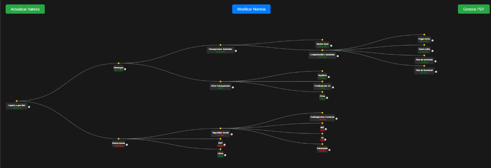

# Nómina Visual 🌟


**Nómina Visual** es una aplicación web interactiva diseñada para visualizar y gestionar nóminas de manera clara y eficiente. A través de un diagrama de árbol dinámico, los usuarios pueden explorar los conceptos salariales como devengos, deducciones, IRPF, Seguridad Social y más. Además, permite modificar valores, añadir nuevos nodos y generar un recibo de nómina en formato PDF.

Este proyecto está construido con tecnologías modernas como **D3.js** para la visualización, **HTML/CSS** para la interfaz y **JavaScript** para la lógica interactiva. ¡Ideal para profesionales de recursos humanos o cualquier persona interesada en entender mejor una nómina!

🎉 **¡Prueba la aplicación en vivo!**  
👉 [Visita Nómina Visual en GitHub Pages](https://adriangonzalezblanco.github.io/nomina-visual/)

---

## 🚀 Características

- **Visualización Interactiva**: Explora los conceptos de una nómina mediante un árbol dinámico creado con D3.js.
- **Edición en Tiempo Real**: Modifica valores como el salario base, IRPF, horas extras o pagas extras a través de un modal intuitivo.
- **Añadir y Eliminar Nodos**: Personaliza la estructura de la nómina añadiendo nuevos conceptos o eliminando los no deseados.
- **Generación de PDFs**: Exporta la nómina en un recibo profesional en formato PDF con un diseño claro y estructurado.
- **Tooltips Informativos**: Obtén información detallada de cada concepto al pasar el cursor sobre los nodos.
- **Diseño Responsivo y Moderno**: Interfaz limpia y adaptada para una experiencia de usuario óptima.

---

## 📸 Captura de Pantalla

  
*Interfaz interactiva mostrando el árbol de conceptos de una nómina.*

> **Nota**: Asegúrate de subir una captura real de tu proyecto al repositorio como `screenshot.png` y ajusta el nombre del archivo si es necesario.

---

## 🛠️ Tecnologías Utilizadas

- **D3.js**: Para la visualización del árbol interactivo.
- **HTML5/CSS3**: Estructura y estilos de la interfaz.
- **JavaScript**: Lógica de interacción y cálculos dinámicos.
- **jsPDF & html2canvas**: Para la generación de PDFs.
- **GitHub Pages**: Hospedaje de la aplicación en línea.

---

## 📦 Instalación Local (Opcional)

Si deseas ejecutar el proyecto en tu máquina local, sigue estos pasos:

1. **Clona el repositorio**:
   ```bash
   git clone https://github.com/adriangonzalezblanco/nomina-visual.git

2. **Accede al directorio del proyecto:**
    ```bash
    cd nomina-visual
    
3. **Abre el archivo index.html en tu navegador**
    Puedes abrirlo directamente o usar un servidor local (recomendado). Si tienes live-server instalado, ejecuta:
    ```bash
    live-server

4. **Explora y modifica:**
    - Usa el botón "Modificar Nómina" para editar valores como el salario base, IRPF o añadir conceptos.
    - Haz clic en "Actualizar Valores" para reflejar los cambios en el árbol.
    - Genera un PDF con el botón "Generar PDF".

## 📝 Uso

1. **Visualiza la Nómina:** Al cargar la página (ya sea en GitHub Pages o localmente), verás un árbol interactivo con los conceptos principales de una nómina (Devengos, Deducciones, etc.).
2. **Edita Valores:** Haz clic en "Modificar Nómina" para abrir un modal donde puedes:
    - Cambiar el salario base.
    - Ajustar el porcentaje de IRPF.
    - Añadir horas extras o pagas extras.
    - Crear nuevos conceptos personalizados.

## 📊 Estructura de la Nómina
El árbol de conceptos está organizado de la siguiente manera:

**Líquido a Percibir:** Total neto que recibe el empleado.
    **Devengos:** Ingresos brutos antes de deducciones.
        **Percepciones Salariales:** Salario base, complementos salariales, horas extras, pagas extras.
        **Otras Percepciones:** Suplidos, prestaciones de Seguridad Social, etc.
**Deducciones:** Descuentos aplicados al salario bruto.
    **Seguridad Social:** Contingencias comunes, desempleo, formación, etc.
    **IRPF:** Impuesto sobre la renta.
    **Otros:** Deducciones adicionales.

## 🖥️ Ejemplo de Uso
    1. Cambia el salario base a 1500€ y el IRPF a 15%.
    2. Añade unas horas extras por valor de 200€.
    3. Actualiza los valores y observa cómo se recalcula el líquido a percibir.
    4. Genera un PDF con el recibo actualizado.

## 📜 Licencia
Este proyecto está protegido bajo una licencia de Derechos Reservados (All Rights Reserved). No se permite copiar, modificar, distribuir